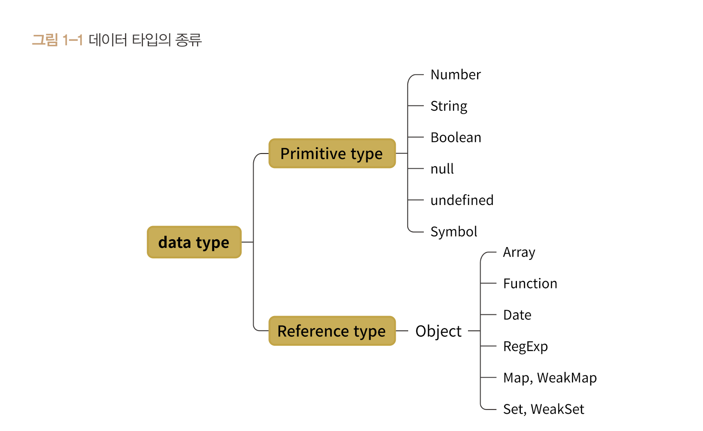

# 데이터타입의 종류

자바스크립트에서의 데이터 타입에는 크게 두 가지로 나눌 수 있다.

1. 기본형 (primitive type, 원시형이라고도 불림)
2. 참조형 (reference type)

 

기본형에는 Number, String, Boolean, null, undefined, Symbol

참조형에는 Object에서 뽑아져 나오는 Array, Function, Date, RegExp, Map, WeakMap, Set, WeakSet이 있다.

 

## 무슨 기준으로 기본형과 참조형을 구분하는 걸까?

일반적으로는 기본형은 할당이나 연산을 실시할때 복제가 되고 참조형은 그냥 참조된다고 알고있다.

엄밀히 따지면 **기본형, 참조형 모두 복제를 한다.**

기본형은 값이 담긴 주솟값을 바로 복제, 참조형은 값이 담긴 "주솟값들로 이뤄진 묶음"을 가리키는 주솟값을 복제한다.

이리하여 기본형은 **불변성을 띈다** 다로 말한다.

그럼 불변성은 무엇일까?

[불변값](./불변값.md)

