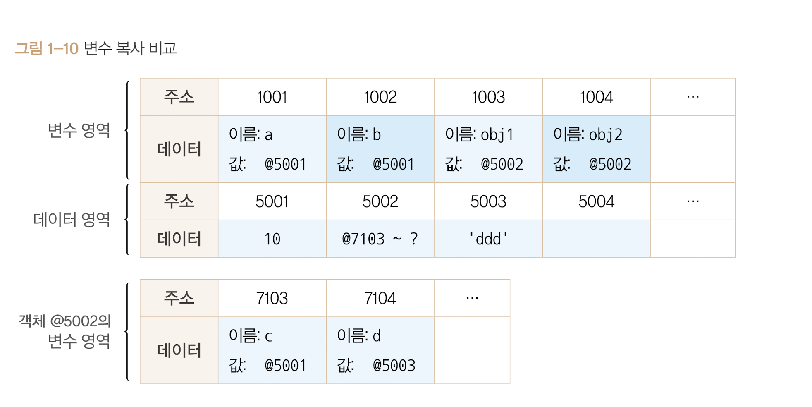

# 변수복사비교

기본형 데이터와 참조형 데이터의 차이를 더 자세히 알아보자.

우리는 기본형과 참조형의 차이는 기본형의 값은 불변성을 띄고 참조형은 불변성을 띌수도, 아닐수도있다 [데이터타입의종류]([유한나라]데이터타입의종류.md)였다.

더 자세한 차이는 **변수를 복사하는 과정에서 드러나는데**


<br>
<br>

```js
var a = 10;
var b = a;

var obj1 = {c: 10, d: 'ddd'};
var obj2 = obj1
```

변수 a를 선언후 값을 할당하였고 변수 a를 변수 b에 담은 경우 하나

변수 obj1를 선언후 객체를 할당하고 변수 obj1을 obj2에 담은 경우 하나가 존재한다.

각각의 변수와 데이터를 그림화 시키면 다음과 같다.

<br>



<br>

이처럼 변수를 복사하는 과정에서의 기본형과 참조형은 같은 주소를 바라보는 형태를 띈다.

하지만 데이터 할당 과정에서의 차이가 있기때문에 **복사 이후 동작에 차이가 발생한다.**

복사이후 값을 변경한다면 어떻게 될까?

```js
var a = 10;
var b = a;

var obj1 = {c: 10, d: 'ddd'};
var obj2 = obj1

b = 15;
obj2.c = 20; 
```

b 의 값을 15로 바꿨다. 데이터 영역에서 15를 찾는다음 없으므로 새로운 공간에 15를 저장하고 그 값의 주솟값을 b의 값에다가 재할당한다.

<br>

obj2.c의 값을 20으로 변경했다. 일단 데이터에 20이 있는지 찾고 없으므로 새로운 공간에 20을 저장한다. 식별자 obj2를 찾고 값에 할당된 공간의 주소로 이동, 데이터영역에서 객체에 대한 변수영역들이 있을 것이고 그곳으로 이동, 이동한다음 식별자 c를 찾고 그곳에 할당되있는 주솟값을 20을 부여한 데이터영역의 주솟값으로 재할당한다.

<br>

**이렇게된다면 a,b가 가르키는 값의 주소는 달라졌지만 obj1, obj2가 가르키는 값의 주소는 같아진다.**

**이유는 참조형은 데이터 할당하는 과정을 한번 더 거치게 되기 때문이다.**

<br>

하지만 객체 자체를 변경한다면 어떻게될까?

새로운 공간에 새 객체가 저장되고 결국 가르키는 주소 값도 달라질 것이다!


<br>

결론 : 참조형 데이터가 '가변값'이라고 설명할때의 가변은 **데이터 자체를 변경할 때가 아닌 내부의 프로퍼티를 변경할 때이다**