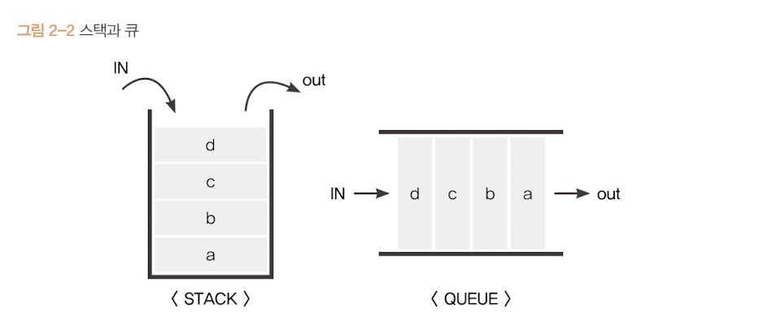

# 실행컨텍스트란?

실행컨텍스트를 자세히 알기 위해선 스택과 큐의 개념을 알고 있어야 한다.

<br>

## 스택, 큐

<br>



- 스택(Stack) : LILO (Last In Last Out)
- 큐(Queue) : FIFO (First In First Out)


<br>

## 실행 컨텍스트와 콜 스택의 관계

실행 컨텍스트는 **실행할 코드에 제공할 환경 정보들을 모아놓은 객체**라고 소개했다.

"동일한 환경"에 있는 코드들을 실행할 때 환경 정보를 모아 컨텍스트를 구성한다.

> 동일한 환경
>
> 실행 컨텍스트를 구성할 수 있는 방법 : 전역공간, eval(), 함수 등

이후 콜 스택에 쌓아올리고 최상단부터 코드를 실행합니다.

이 과정을 거치면서 코드는 실행된다.

여기서 중요점은 실행 컨텍스트는 **함수를 실행**할때 생성된다.


<br>

### 실행 컨텍스트와 콜스택이 실행되는 순서

<br>

```js
var a = 1;

function outer() {
    function inner() {
        console.log(a); // undefined
        var a = 3;
    }
    inner();
    console.log(a) // 1
}

outer();
console.log(a); // 1
```

위 코드가 콜 스택에 실행 컨텍스트가 어떤 순서로 쌓이고 실행되는지 알아보자.

<br>

1. 전역 컨텍스트가 생성되며 콜스택에 쌓인다.
2. outer함수가 호출되면서 outer실행 컨텍스트가 생성되며 콜스택에 쌓인다.
3. inner함수가 호출되면서 inner실행 컨텍스트가 생성되며 콜스택에 쌓인다.
4. inner함수안의 console.log(a)가 실행되며 Console에 undefined가 출력된다.
5. inner함수가 실행되었으므로 콜스택에서 inner실행 컨텍스트가 빠진다.
6. outer함수 안의 console.log(a)가 실행되면서 Console에 1이 출력된다.
7. outer함수가 실행되었으므로 콜스택에서 outer실행컨텍스트가 빠진다.
8. 전역 컨텍스트에 console.log(a)가 실행되면서 Console에 1이 출력된다.
9. 전역 컨텍스트가 콜스택에서 빠진다.
10. 코드가 종료된다.


<br>

위 구조를 잘 보면 한 실행 컨텍스트가 콜 스택에 쌓이는 순간 현재 실행할 코드에 관여하게 되는 시점이라는 것을 알 수 있다.

**실행 컨텍스트가 활성활될 때 자바스크립트 엔진은 컨텍스트에 관련된 코드를 실행하는데 필요한 환경 정보들을 수집하여 실행 컨텍스트 객체에 저장한다.**

하지만 실행 컨텍스트 객체는 엔진이 활용할 목적으로 생성한 것이라 코드를 통하여 확인을 할 수는 없다.

그렇다면 이 실행 컨텍스트 객체 안에 담기는 정보는 어떤 정보들이 담길까?

[실행컨텍스트의수집정보](./[유한나라]실행컨텍스트의수집정보.md)